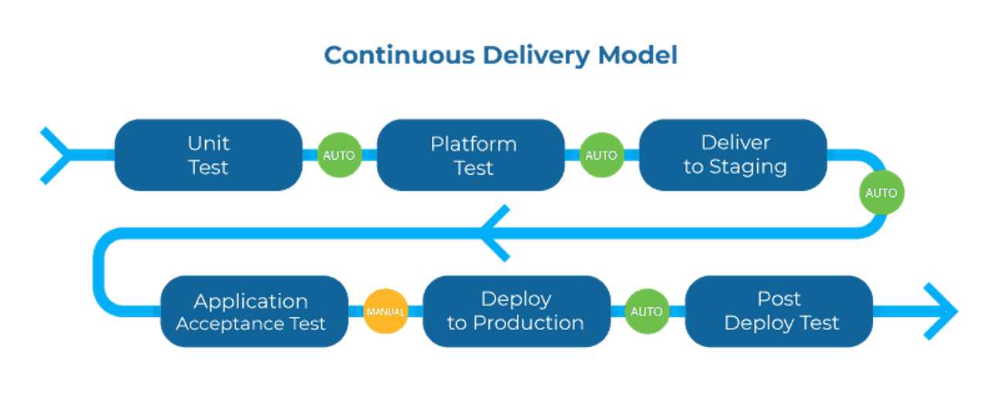
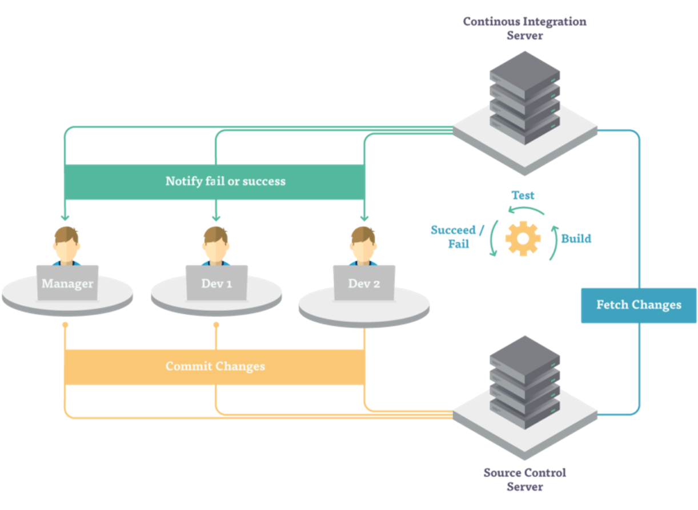

## Good project management principles

Extreme Programming
* Iterative development with frequent development
  * User Stories (contains role, requirements and reasons)

Scrum Process:
Product owner -> Get some goals sorted -> Sprints ->Stand ups -> development

github actions: free continuous integration

follow test-driven development (write tests -> pass tests -> refactor)

Refactoring code: restructuring it without changing any external functionality

## Could follow the waterfall or agile methods but discuss that in the report in depth

## Git
git log: to see git history
gitk : git dashboard
git checkout master: switches to the master branch

Use github flow during development
review changes

github workflow

## Docker + Linking

Dynamic Linking: Load libraries from a disk to a separate file rather than having a whole library attached to every single program

containers (the docker way): chroot