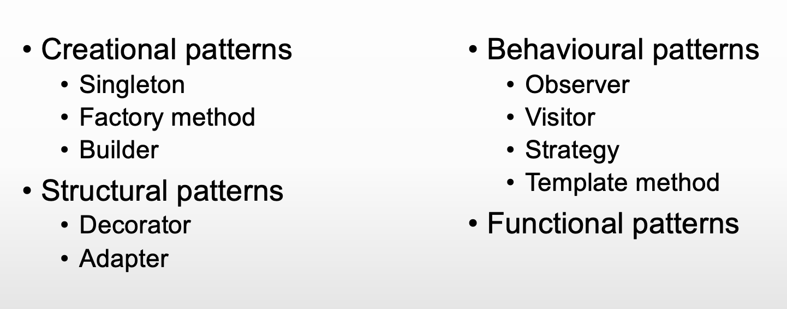

# Software Architecture and principles

- Use abstraction and encapsulation
- Abstraction is used to enforce encapsulation, so that a piece of code is required for one purpose

# Software Design Patterns

**Singleton**
DONT USE:
- Only one instance of an object: singleton,
  -  can do a thread safe lazy intialisation, only initialise the singleton when you actually need an instance otherwise don't OR can
  -  can do a thread safe lazy intialisation (double checked locking) to avoid a thread race condition where multiple threads are trying to do the same thing
  -  creates a memory leak
- Global variables

**Factory**
USE
- When you don't know the complete set of tyeps of dependencies
- Create objects without having to specify the exact class
- When you want to provide users a framework and they can extend it
- Design patterns 1 demo (refer)

**Builder**
USE FOR PARSING ARGUMENTS
- Lets you construct complex objects step by step
- You build your object that has the variables that it actually requires
- library clap for rust command line parser for rust (can check to understand builder more)

**Decorator**
USE FOR IMPLEMENTING UNSAFE APPLICATIONS
- Attaches new behaviours to existing objects
- When you want to add extra behaviours to the objects at run time
- When it's not possible to extend using inheritance
- It's like adding a wrapper around them

**Adapter**
- Converts the interface of a class into another interface that clients expect
- Provides a completely different interface