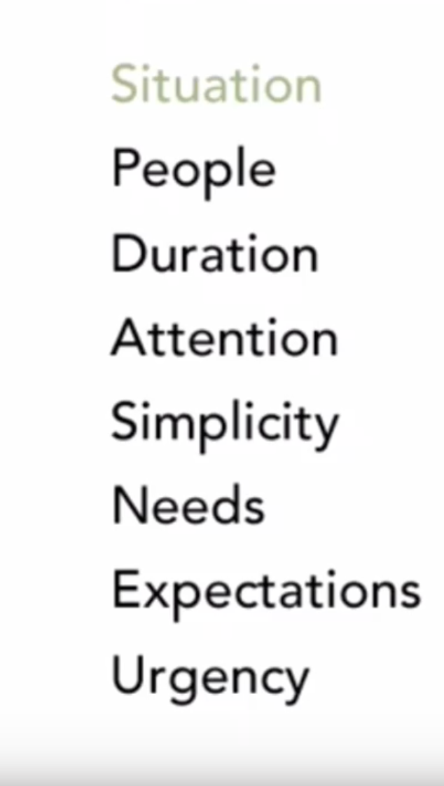
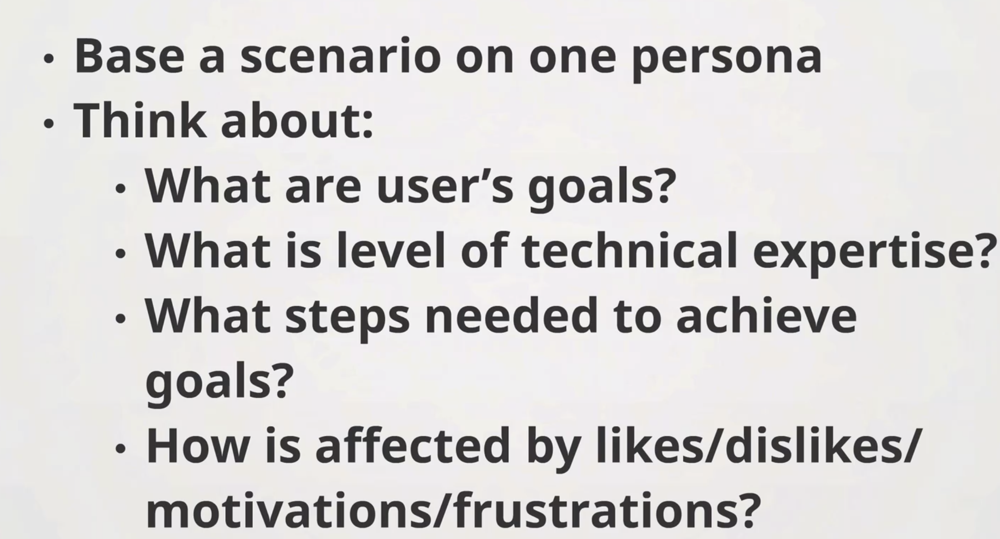

- What are their goals?
- What needs do they have?
- Expectations with product or service

CRM data, analytics, order history

IDENTIFY BEHVAIOURAL VARIABLES
SIGNIFICANT BEHAVIOURAL PATTERNS
SYNTEHSISE CHARACTERISTICS AND SIGNIFICANT GOALS
CHECK FOR REDUNDANCY AND COMPLETENESS

who, what when where why how

Scenarios
- Story/ sequence of action or corresponding events
  
- simple, natural, personal
  
- 