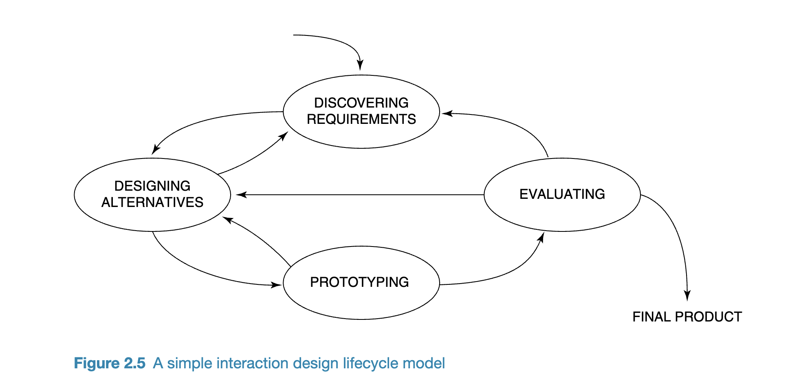

# Systems Week 2
---
## HCI Reading Chapters 1, 2

Good example of design:
* Durrell Bishop's Marble Answering Machine: makes use of everyday items and our interactions with it to listen to recorded messages, which makes it easier to use and understand and is efficient 
    ```diff
    - But can't be used in a hotel setting because can't authenticate who the user is and the marbles could be nicked
    ```
* Tivo tv remote
* Apple ipod

When designing items, the user has to be considered at all times, how are they going to be using the item, who and where:
* Considering what people are good and bad at
* Considering what might help people with the way they currently do things
* Thinking through what might provide quality user experiences
* Listening to what people want and getting them involved in the design
* Using user-centered techniques during the design process

Interaction design can be categorised based on how it is approached and what the scope is.
You want diverse team for a wider range of ideas and fresh perspectives but may have some teamwork issues maybe

Quality of user experience is important, build something that's enjoyable, exciting and pleasurable to use

**Chat GPT summary of the 'technology as an experience framework':**
* User-Centered Focus: Prioritize the user's needs, emotions, and perspectives. Consider how they interact with the technology and how it fits into their daily lives.

* Holistic Experience: Understand that the user's interaction with technology goes beyond mere functionality. It encompasses the entire journey, from initial discovery to eventual obsolescence.

* Emotional Engagement: Recognize the emotional responses technology can elicit, whether it's joy, frustration, satisfaction, or others. Design for positive emotional experiences.

* Integrated Ecosystems: Understand that most technologies don't exist in a vacuum. They are part of larger ecosystems, whether it's software integrating with hardware or apps interacting with other apps. The experience should be seamless across the ecosystem.

* Feedback Loops: Implement mechanisms for users to provide feedback. This helps in refining and enhancing the experience over time.

* Adaptive & Personalized: With advancements in AI and machine learning, technologies can now adapt and personalize user experiences based on preferences and behaviors.

* Accessibility & Inclusivity: Ensure that technology is accessible to all, including those with disabilities. An inclusive design ensures a wider reach and a better overall experience.

* Ethical Considerations: As technology becomes more integrated into our lives, it's crucial to consider the ethical implications, such as privacy, security, and the potential for misuse.

* Iterative Design: The design process should be iterative, involving testing, feedback, and refinement to ensure the technology evolves with the user's needs.

* Future-Proofing: Design with the future in mind. This includes ensuring that technologies can adapt to future trends and changes, and that they remain relevant and usable.

Also consider if the device is pragmatic and hedonist (pragmatic: simple, practical and easy to use, hedonistic: how pleasurable and stimulating)

Understand your users: where they live, what are their motivations, age range, what do they do, what are their expectations, being aware of their sensitivities, cultural differences, disabilities

## Usability and User experience 

**Usability**
- Effective to use (how good the product is at doing what it's supposed to do)
- Easy to learn
- Efficient to use (how does it support the users in carrying out their tasks)
- Good utility (to what extent does the tool provide the right kind of functionality, does the tool provide an appropriate set of functions to the user)
- Easy to remember how to use
- Safe to use (protecting the user from dangerous conditions - prevent the user from making serious errors by removing too many button options, give the user a way to be able to recover should they make erors)
- memorabilit (how easy it is to remember how to use to the product once you've learnt it)

Follow some usability criterias like:
- time taken to complete a task (efficiency)
- time to learn a task (easy to learn)
- number of errors made when carrying out a given task over time (memorability)

**User Experience**
User Experience Goals


- try and get users into a flow state where it's an immersive emotional experience
- single interactions or micro-interactions that they may like like the noise of the trash can or switch flick motions can be incorporated to make it a better experience
- Don't follow dark patterns where you sneakily add stuff in that the user has to deselect, it's a negative user experience
  

## Design Principles

- Visibility
- Feedback
- Constraints
- Consistency
- Affordance : do people know how to use it (like when they see a button they know they have to push it. for virtual screens, you can used more learned things like swiping and zooming actions)
  
Focus on a few design principles rather than trying to use everything because they may not gel well together
Go for simplicity and aesthetic appeal

## Design Cycle Phases


- consider user concerns
- trade-offs may be involved

1. Understand the problem space 

   - There are four forms of design: User-centred, activity centred, systems design and genius design
  
2. Need to consider expectation management (manage their expectation of the end product) and ownership from users (involve users and make them contribute towards the project)
   - Need to consider the levels and types of user involvement. They should be involved to some extent but the questions that they are asked and the stage at which they are involved will decide the efficency with which things are done through the project [for us it would probably be 40% user involvement in how they want the panel to look like and research studies on the same]
   - Have someone join in with you throughout the whole process to give their input or have concentrated group tasks at selected intervals so that their opinion is taken incrementally
  
3. User centred approach
   

   **Early focus on users and tasks**
   - What technologies are available to provide better support to the user's goals?
   - Users' behaviours and contexts are studied and the system is designed accordingly
   - Capture Users' characteristics (Cognitive and Physical: Cognitive like attention, memory and perception and physical like height, eyesight and mobility)
   - Users are consulted through the development process, from the early to late stages
   - Design decisions are taken in context of their environment and activities

    **Empirical Measurement**
    - Identify usability and user experience goals from the star tand use them to evaluate the proceedings in the design process

    **Iterative Design**
    - Go through the cycle of feedback several times so that user expectations are managed and the user is satisfied
  

Conceptual Design: An idea of what people could do with the product and an abstraction of that is used
Concrete Design: Detail of the product


- There's something called the google design sprint that aims to do the above in 5 days but it doesn't result in a robust product obviously but meets atleast some customer expectations and you know if you are heading in the right direction