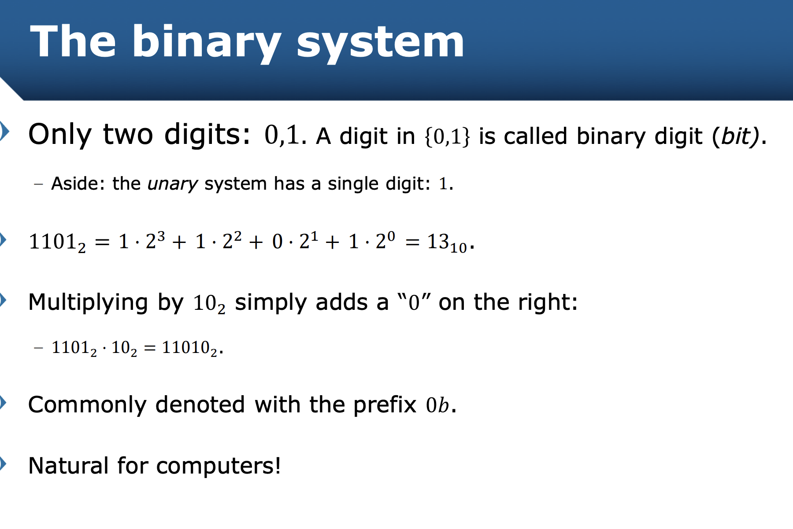
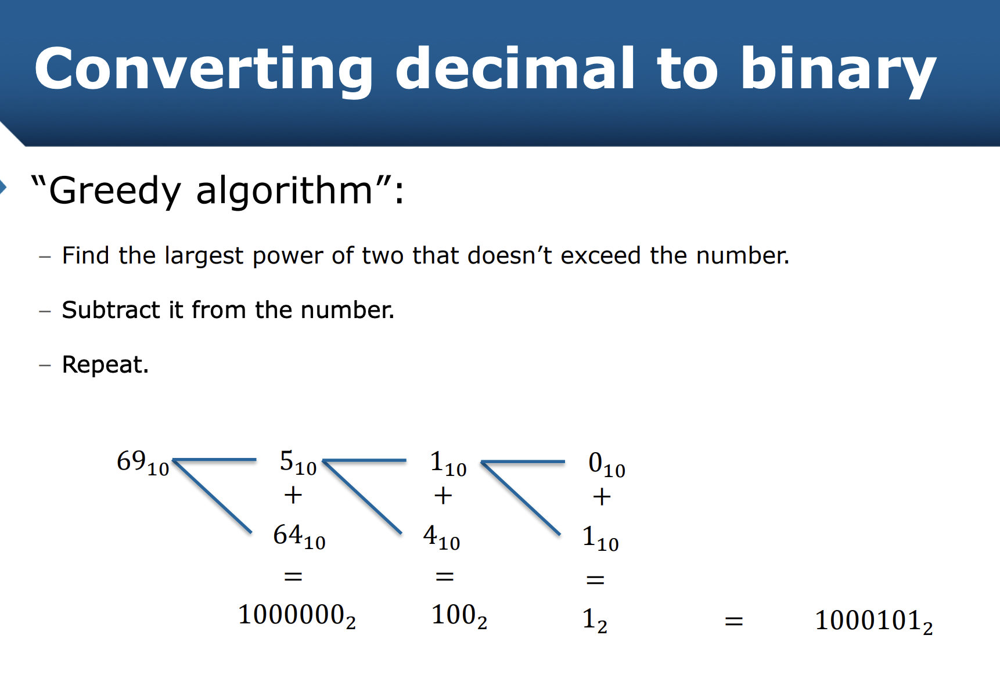
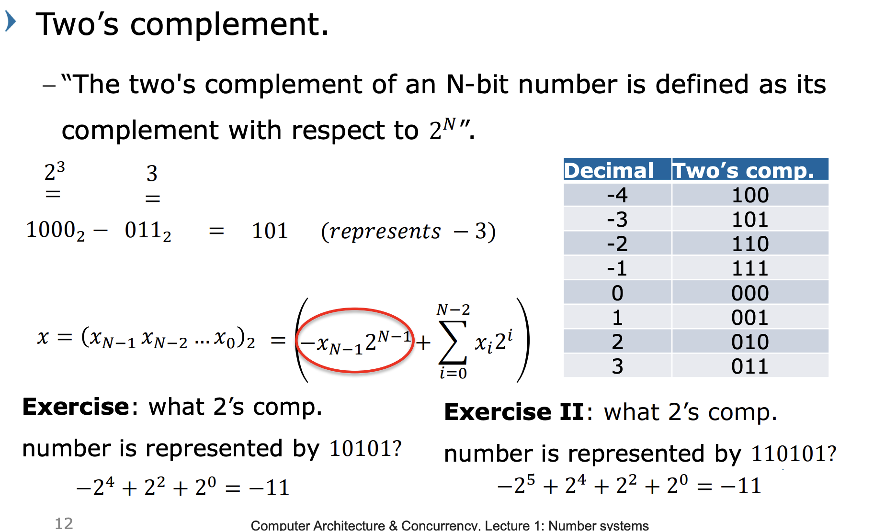
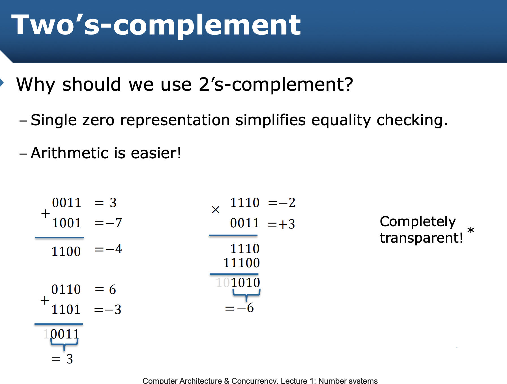

# Week 1 Number Systems

Moved from an ancient system to a positional number system

write the base next to the number in subscript: 176~10~

can convert binary to hex by looking at groups of 4 digits

Ob is often used as a prefix to show that it is a binary number
0x for hex

maths uses signed magnitude representation to represent positive and negative numbers, but it's not ideal:
- two representations for 0, +0, -0
- complicates calculations

Two's complement:
2^N - N where both are in binary will give the negative value for N.

## Calculating the decimal when you have the 2's complement:

You can do arithmetic with binary and two's complement but just need to check for overflow.
If you consider the bits that dont fall into the overlfow, you still get your decimal answer.

