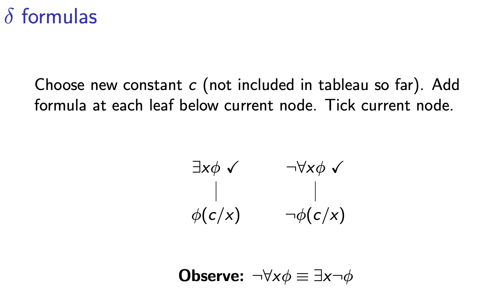
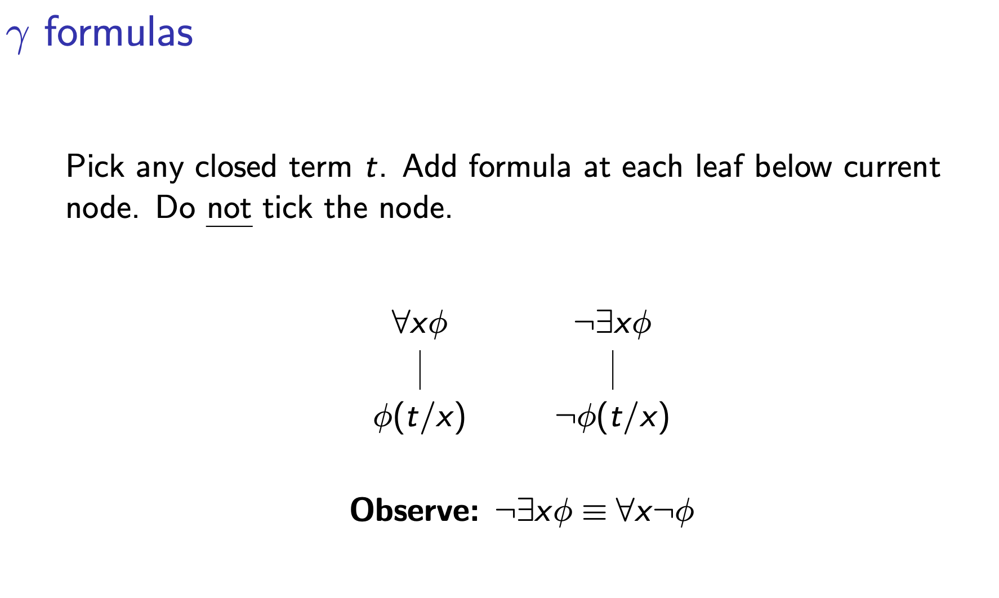

- A term is a function symbol applied to variables and constants, it only has free variables, no quantifiers
- A literal is an atom or its negation

# DELTA FORMULAE
- Have an existential quanitifier at the beginning 
  OR
- Have a negated for all quantifier 
- Deal with it by substituting all free occurences of it (eg x) with a constant that represents the solution (eg c)

# GAMMA FORMULAE
- Have a for all OR a negated existential
- Don't tick because when substituting x for a closed term t, you're only checking one case and there are several more
