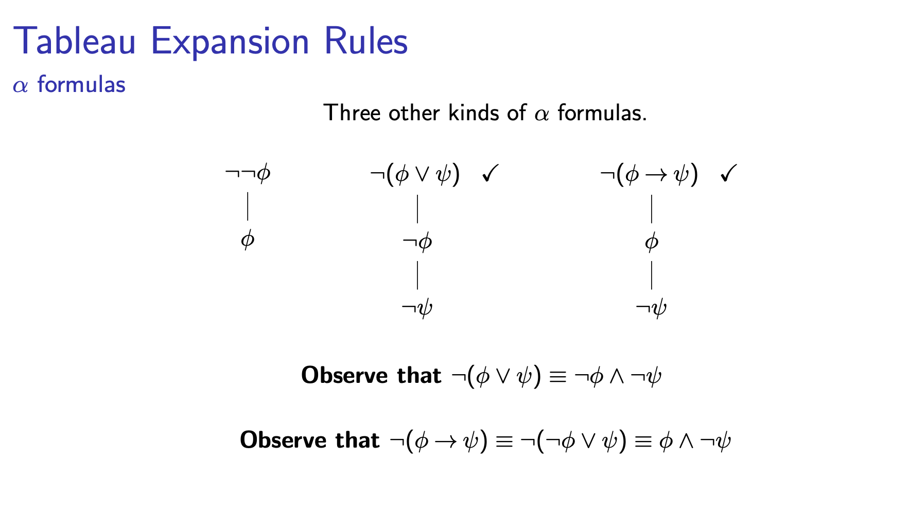
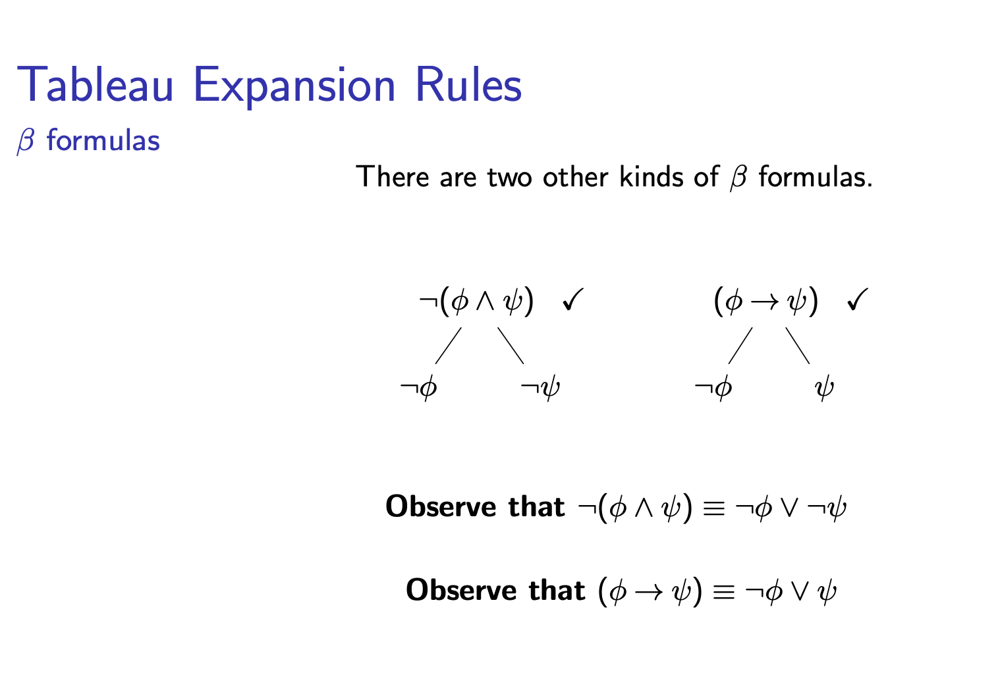
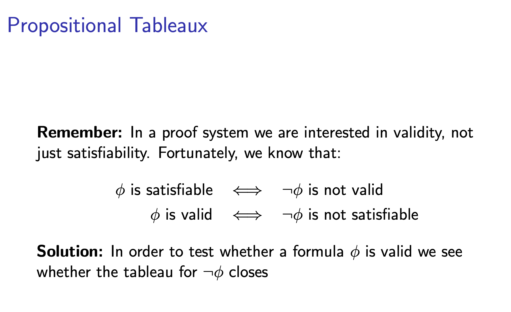
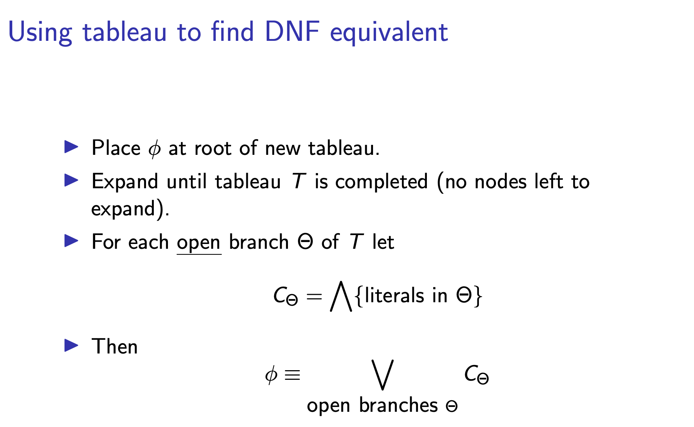
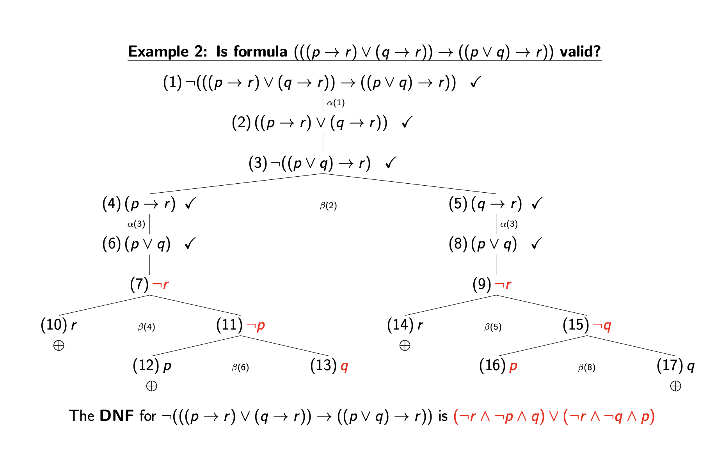
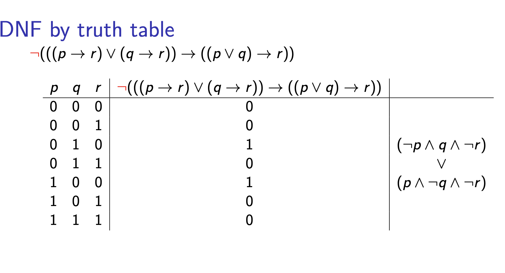

# Tableau form for propositional logic

Consider it to be a binary tree with the formula on each end
A node can be closed if you have a q /\ ~q
If all nodes are closed for tree T then T is closed and the formula is unsatisfiable

formula: proposition, ~formula, (f1 o f2) - binary, (f1 \/ f2), (f1 /\ f2), (f1 -> f2)

~fm :=| ~prop | ~~fm | ~(f1 \/ f2) | ~(f1 /\ f2) | ~(f1 -> f2)

Forms of formulae:
- /\ = alpha
- \/ = beta
- -> = beta

To check validity: 
- negate, if tableau closes then it's valid otherwise not valid
- would be valid because for a fm f1, if you consider ~f1 and ~f1 is proven as unsatisfiable then f1 must be satisfiable

ALPHA:
- create one leaf below the other in the tableau
- conjunctions (and)

BETA:
- create two leaves below the root leaf
- disjunctions (or)

A tableau is complete if every node is either ticked or a literal
A node is ticked if it has been expanded
A literal is a proposition here

**If φ is at the root of a complete open tableau, then φ is satisfiable.**

You can use the following methods to get a DNF:
- Tableau
- Truth Table
- Logical Equivalences (De Morgan’s laws, distribution laws, etc.)

**How to get a CNF**
