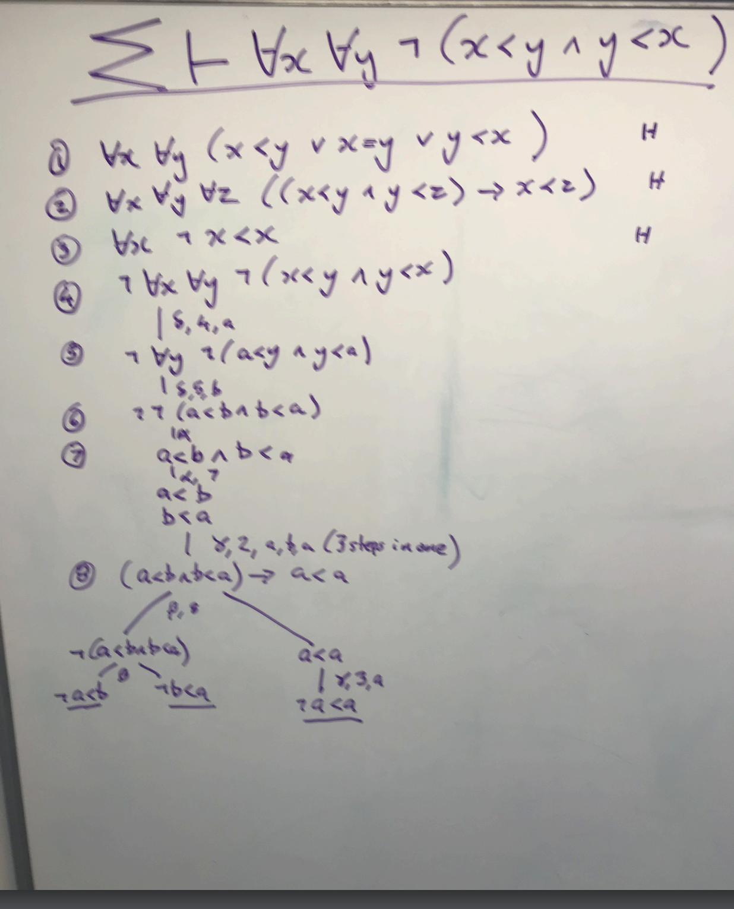

define a node n
n <- T is good if it has infintely many descendants
Root r is good

path := [r, ..., nk]
nk is good by IH (induction hypothesis):

nk has finitely many children at least one is good, pick one, let it be nk+1
Continue forever

sound only proves valid things
complete proves arbitrary valid things

you must use a fair schedule

semi-decidable logic

L structure: same as first order structure but with defined symbols

If something is provable then it's valid: soundness
If something is valid, it's provable: completeness
Even if you have an infinte set of assumptions, if gamma entails phi, then you can prove gamma using the set of assumptions : sound completeness

Do the tableau in a fair schedule, something will be added to each branch/in a queue then you should be okay
alpha, beta, delta gamma (take the first gamma from the queue, expand using the first closed term and repeat)

1st hypothesis: totality
2nd hypothesis: transitivity
3rd hyp : irreflexive

use old constants for gamma formulae