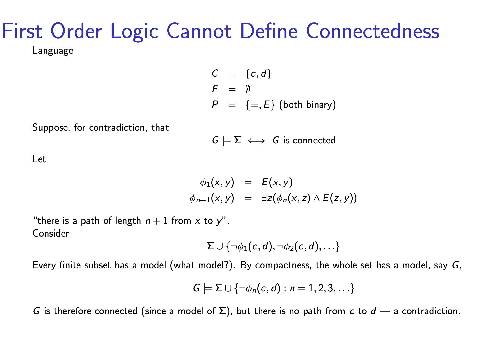

# Directed graphs

(G, E) E is a subset of G x G

Path connected means 
For every x, For every y, there is a finite sequence (x0, x1, s2, ..., xk-1) (some k >= c)
    such that x = x0, y = xk-1 
    and (xi, xi+1) is a subset of E for i < k-1

# Connectedness

an example would be k+1 nodes joined by double ended arrows

# Compact theorem and non-standard analysis

